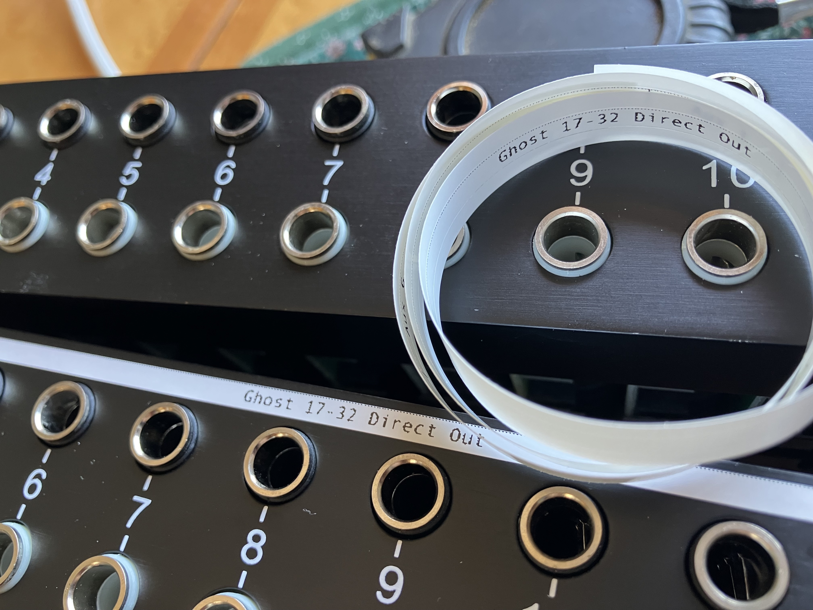
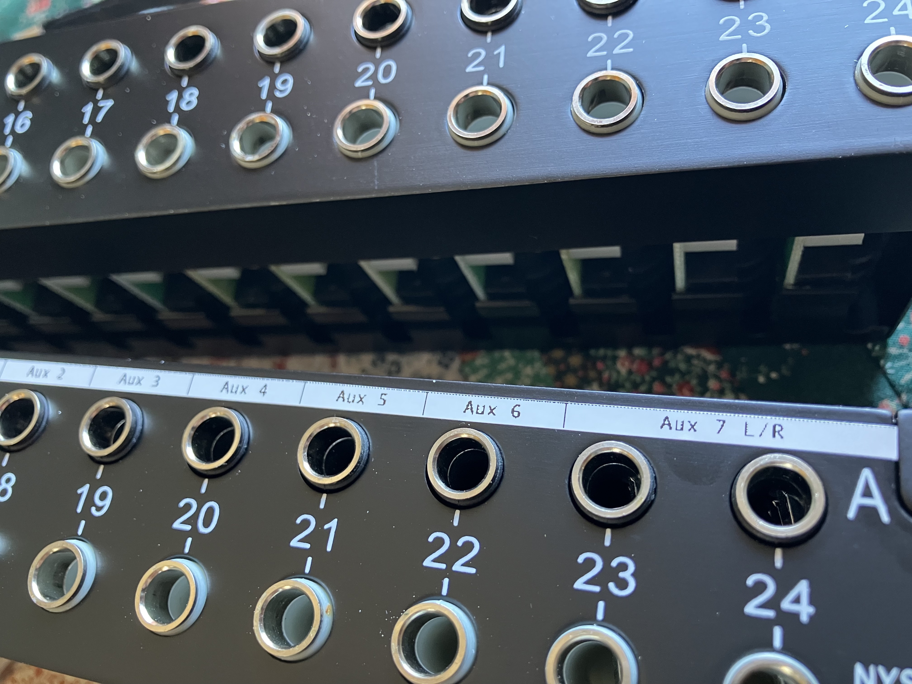

# Python Patch Bay Label Generator

## Features
- Store patch bay routing definitions as code
- Use version control to track changes to patch bay layout
- Auto generate labels

## The Printer

Brother P-Touch printer
TODO: add affiliate link to Brother printer here
https://www.amazon.com/Brother-P-Touch-Connectable-Label-PT-P700/dp/B00DSYEB28/ref=sr_1_18?crid=36COVIQ2VXGF8&keywords=brother%2Bp%2Btouch&qid=1690056448&sprefix=broter%2Bp%2Btouc%2Caps%2C166&sr=8-18&ufe=app_do%3Aamzn1.fos.006c50ae-5d4c-4777-9bc0-4513d670b6bc&th=1

3.5mm label tape
(small enough to fit the Neutrik 1/4" patch bays I'm using)
TODO: add affiliate link to tape for Tascam patch bay here
https://www.amazon.com/Compatible-Brother-TZe-N201-TZeN201-Non-Laminated/dp/B07C9XPK8P/ref=sr_1_7_sspa?crid=1I5KDO7NMSO60&keywords=p+touch+tape&qid=1690056512&sprefix=p+touch+tap%2Caps%2C132&sr=8-7-spons&sp_csd=d2lkZ2V0TmFtZT1zcF9tdGY&psc=1

## How to use
TODO: write up docs here
- Every time you re-patch something on the patch bay, submit a PR