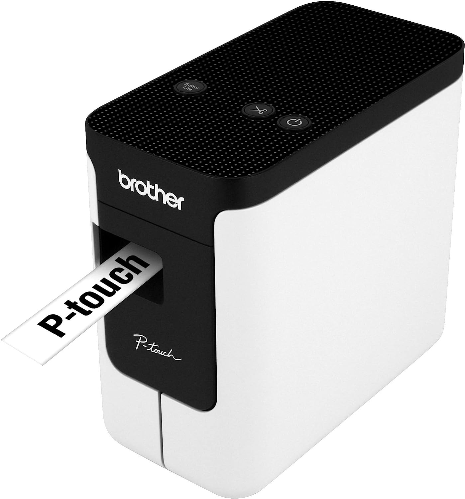
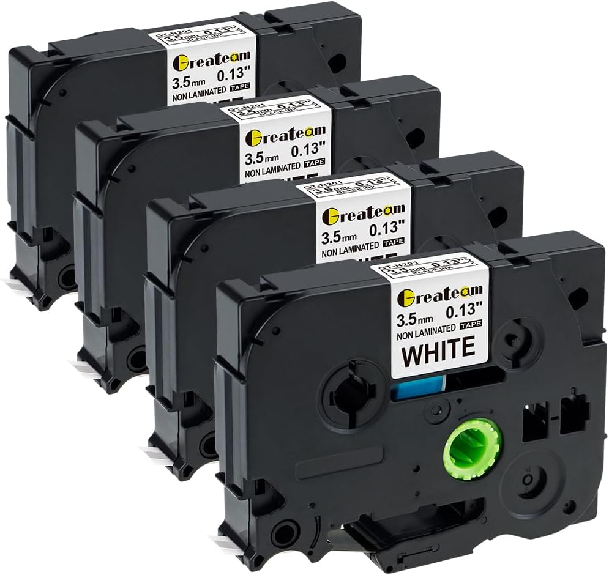
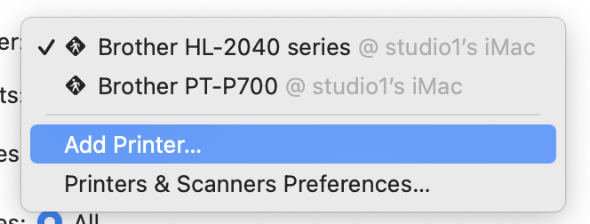
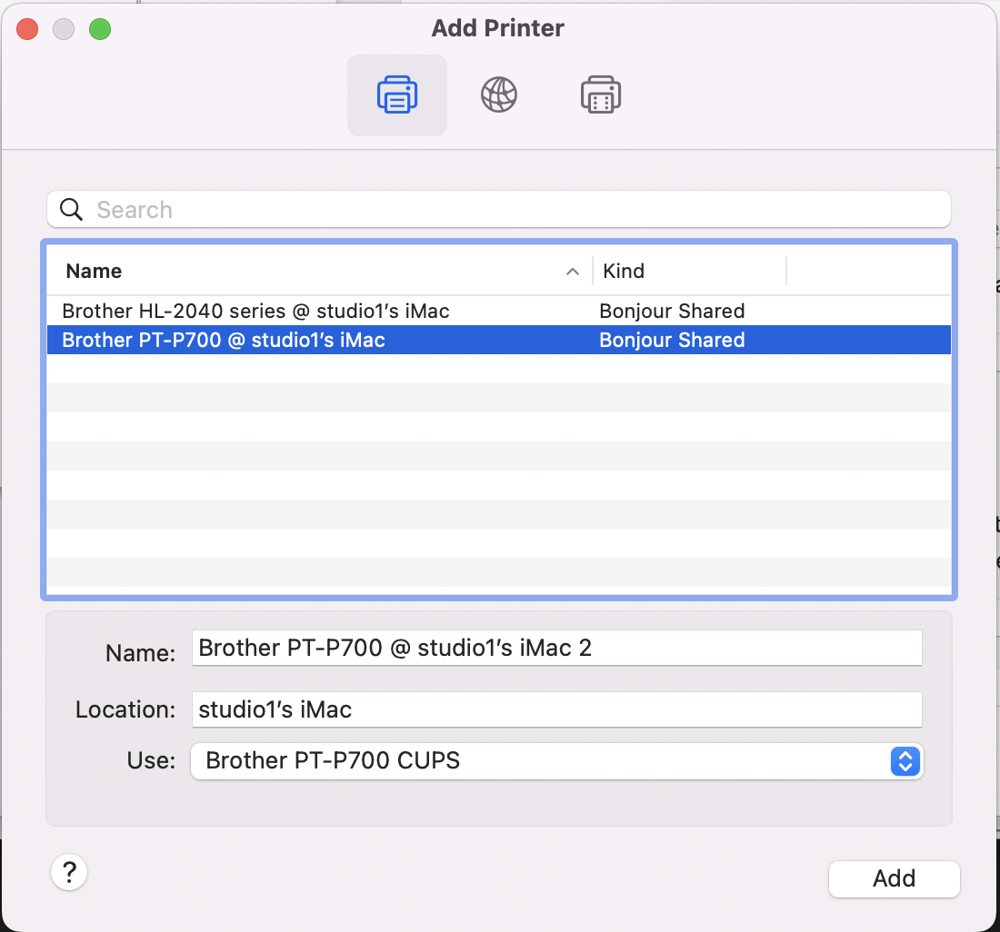
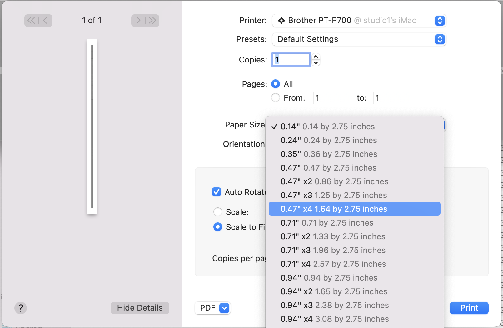
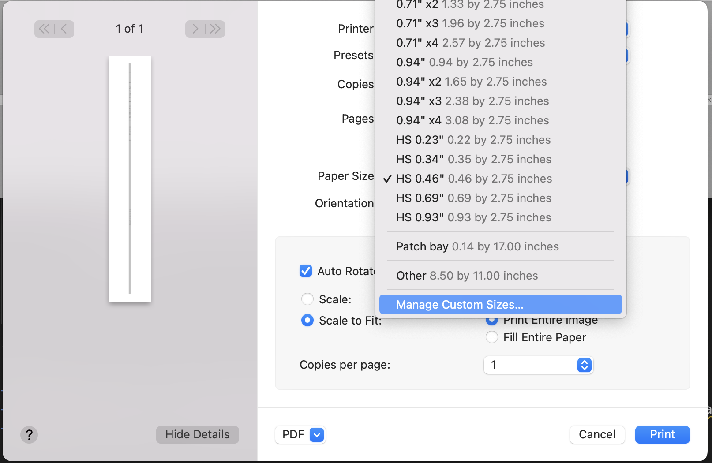
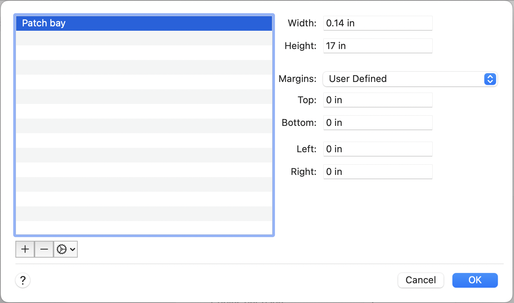

# Python Patch Bay Label Generator


## Features
- Store patch bay routing definitions as code
- Use version control to track changes to patch bay layout
- Auto generate labels

## The Printer


<div>

<a target="_blank" href="https://www.amazon.com/Brother-P-Touch-Connectable-Label-PT-P700/dp/B00DSYEB28/ref=sr_1_18?crid=36COVIQ2VXGF8&amp;keywords=brother%252Bp%252Btouch&amp;qid=1690056448&amp;sprefix=broter%252Bp%252Btouc%252Caps%252C166&amp;sr=8-18&amp;ufe=app_do%253Aamzn1.fos.006c50ae-5d4c-4777-9bc0-4513d670b6bc&amp;th=1&_encoding=UTF8&tag=brianaffil0e6-20&linkCode=ur2&linkId=8dd8a5be6be9965453e015e2a0a9553d&camp=1789&creative=9325">
<p>Brother P-Touch printer</p>

</a>
</div>


<div>
<a target="_blank" href="https://www.amazon.com/Compatible-Brother-TZe-N201-TZeN201-Non-Laminated/dp/B07C9XPK8P/ref=sr_1_7_sspa?crid=1I5KDO7NMSO60&amp;keywords=p+touch+tape&amp;qid=1690056512&amp;sprefix=p+touch+tap%252Caps%252C132&amp;sr=8-7-spons&amp;sp_csd=d2lkZ2V0TmFtZT1zcF9tdGY&amp;psc=1&_encoding=UTF8&tag=brianaffil0e6-20&linkCode=ur2&linkId=dd0d70bf8694c198fba4ebc44b71d410&camp=1789&creative=9325">
<p>3.5mm label tape</p>

</a>
</div>
(small enough to fit the Neutrik 1/4" patch bays I'm using)

## How to use

I've got my personal patch config saved in this repo. At some point I'll remove the config code from the generation script and make this easier to use for others. You can fork the repo, or pull it and modify.

### Editing Patch bay config
- Config is a list of objects, formatted like so:

```
[
  {
    "label_name": "patch-bay-1",
    "entries": [
        {
            "normalled": True,
            "top": "1-24 Inputs",
            "bottom": "1-24 Outputs",
            "width": 24
        },
    ]
  }
]
```

- Width allows you to group things together under the same label
- Normalled: script will generate an underline to visually notify that a patch point is normalled
- Code is currently set to enforce 24 points per bay. This can be modified in the python

### Generating patch label files
- Run `bash generate.sh`
- Your images should be exported to `label_outputs`
- Commit your output images if you want to keep them in version control

### Printing
- Download some drivers?? I don't remember what I did here...

- Add Brother printer to your list of printers



- Printer will have a series of pre-set page sizes. Disregard all of these



- Click on `Manage Custom Sizes`


- Create a new page size to match the settings in your python file.
  - I'm using `17"` width, and `.14"` height for the .13 tape.


- `Auto rotate` and `Scale to Fit` settings seem to work

- Print!